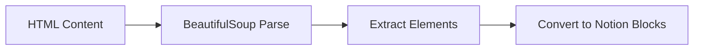

# Database and Storage

This page documents the database and storage components of the MkDocs Notion Plugin.

## Notion Database Structure

The plugin interacts with Notion's API using the following database structure:

| Component | Type | Description |
|-----------|------|-------------|
| Database ID | `string` | Unique identifier for the target Notion database |
| Parent Page ID | `string` | ID of the parent page where documentation will be created |
| Page Title | Text Property | Title of each documentation page |
| Content | Blocks | Documentation content converted to Notion blocks |

### Block Types

The plugin supports converting Markdown/HTML content to the following Notion block types:

1. **Text Blocks**
   - Heading 1 (`heading_1`)
   - Heading 2 (`heading_2`)
   - Paragraph (`paragraph`)
   - Quote (`quote`)

2. **List Blocks**
   - Bulleted List (`bulleted_list_item`)
   - Numbered List (`numbered_list_item`)

3. **Code Blocks**

4. **Table Blocks**

Example of a code block:
```python
{
    "object": "block",
    "type": "code",
    "code": {
        "language": "python",
        "rich_text": [{"text": {"content": "..."}}]
    }
}
```

Example of a table block:
```json
{
    "object": "block",
    "type": "table",
    "table": {
        "table_width": 3,
        "has_column_header": true,
        "has_row_header": false,
        "children": [
            {
                "type": "table_row",
                "table_row": {
                    "cells": [["Header 1"], ["Header 2"], ["Header 3"]]
                }
            }
        ]
    }
}
```

## Configuration

### Environment Variables

The plugin requires the following environment variables:

| Variable | Required | Description |
|----------|----------|-------------|
| `NOTION_TOKEN` | Yes | Integration token from Notion |
| `NOTION_DATABASE_ID` | Yes | Target database ID |
| `NOTION_PARENT_PAGE_ID` | Yes | Parent page ID |

### MkDocs Configuration

Add the following to your `mkdocs.yml`:

```yaml
plugins:
  - notion:
      notion_token: ${NOTION_TOKEN}

      parent_page_id: ${NOTION_PARENT_PAGE_ID}
```

## Data Flow

Here's how data flows through the plugin:

The data flow consists of three main stages:

1. **Input Processing**
2. **Content Conversion**
3. **Notion Integration**

Input Processing Flow:


Content Conversion Flow:


Notion Integration Flow:


## Error Handling

The plugin implements the following error handling strategies:

| Error Type | Strategy | Recovery |
|------------|----------|----------|
| API Rate Limits | Exponential backoff | Automatic retry |
| Invalid Token | Early validation | Configuration error |
| Content Parse Error | Skip and log | Continue with next file |
| Network Error | Retry with timeout | Max 3 attempts |

## Performance Considerations

- **Batch Processing**: Content is processed in chunks to avoid memory issues
- **Caching**: API responses are cached to reduce rate limiting
- **Async Operations**: Network calls are made asynchronously where possible
